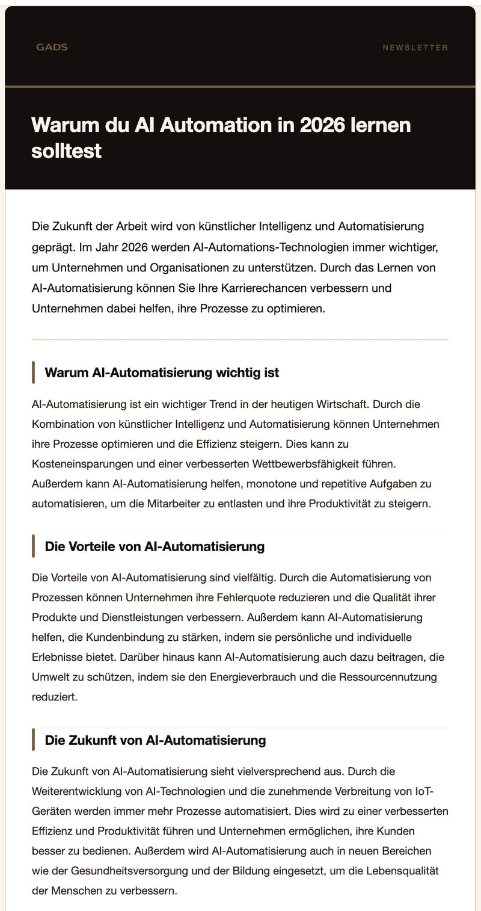
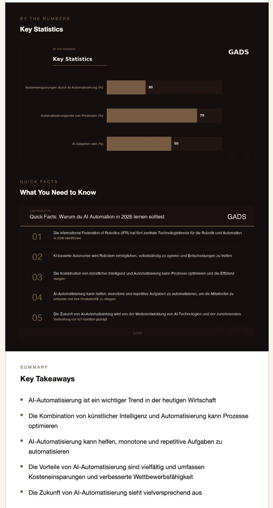

# Newsletter Automation

One prompt in, one finished newsletter out. Research, copywriting, infographics, HTML styling, and Gmail delivery run without manual steps, and the whole stack costs nothing to operate.

```
"Write me a newsletter about: Why you should learn AI automation in 2026"
```

Roughly two minutes later the newsletter is in the inbox: sourced from live web research, written by a 70B model, with a data chart and a fact card rendered from the same research, wrapped in a branded HTML email.

> First automation project, built with Claude Code on the WAT pattern (Workflow, Agent, Tools). Every Python tool in `tools/` was written by the agent, not by hand.

---

## What Happens After the Prompt

```
Topic
  ↓
search_web        DuckDuckGo, 6 results
scrape_page       page text, 4,000 chars each, snippet fallback on paywalls
write_newsletter  Groq / Llama 3.3 70B → subject line, intro, 3 sections,
                  5 takeaways, 2-4 stats, 5 facts as structured JSON
generate_chart    matplotlib bar chart from the stats
generate_factcard Pillow card from the facts, 1200 × 675
format_html       Jinja2 template, images inlined as base64
send_gmail        Gmail API
  ↓
Inbox
```

The agent reads the SOP in `workflows/newsletter_automation.md`, runs the tools in order, checks each output, and handles failures such as a rate-limited search or malformed JSON. Every step writes to `.tmp/`, so any intermediate result can be inspected or corrected before the next step runs.

The topic string drives the language. A German topic produces a German newsletter, no configuration needed.

---

## Zero Running Cost

Every component was picked to stay inside a free tier without giving up output quality.

| Job | Choice | Cost | Why this one |
|---|---|---|---|
| Web search | DuckDuckGo via `ddgs` | free | No API key, no account, retries with backoff on rate limits |
| Scraping | requests + BeautifulSoup | free | Local parsing, falls back to the search snippet when a page blocks |
| Writing | Groq, `llama-3.3-70b-versatile` | free tier | 1,000 requests per day, and one newsletter costs exactly one. Groq inference is fast enough that the writing step is not the bottleneck |
| Chart | matplotlib | free | Rendered locally instead of through a paid chart or image API |
| Fact card | Pillow | free | Same reason, full control over the brand palette |
| Email HTML | Jinja2 | free | Own template instead of an email service subscription |
| Delivery | Gmail API | free | No Mailchimp or Brevo plan, OAuth desktop flow, no per-mail charge |

One newsletter costs zero euros and one Groq request. The only paid alternative worth considering is a search API, and only if DuckDuckGo rate limits become annoying.

---

## Example Output




The chart and the fact card are generated per newsletter from the extracted statistics and facts. Both use the same palette as the email template.

---

## The WAT Pattern

| Layer | Where | Job |
|---|---|---|
| Workflow | `workflows/*.md` | Markdown SOPs: objective, inputs, tool order, edge cases. Written in plain language |
| Agent | Claude Code, briefed by `CLAUDE_WAT.md` | Reads the workflow, decides what to run, reacts to errors, updates the SOP when it learns something |
| Tools | `tools/*.py` | One job per script, deterministic, no model logic except in `write_newsletter.py` |

The reason for the split is the error rate. Five chained steps at 90 percent accuracy each succeed 59 percent of the time. Keeping execution in plain Python and leaving only the orchestration to the model is what makes the pipeline repeatable.

Each tool prints a JSON line to stdout, so the agent can read the result of a step instead of guessing whether it worked.

---

## Project Structure

```text
newsletter_automation/
├── CLAUDE_WAT.md                  # Agent briefing: how to use workflows and tools
├── workflows/
│   ├── newsletter_automation.md   # Main SOP: setup and full run
│   └── research.md                # Search and scrape sub-workflow
├── tools/
│   ├── search_web.py              # → .tmp/search_results.json
│   ├── scrape_page.py             # → .tmp/scraped_content.json
│   ├── write_newsletter.py        # → .tmp/newsletter_content.json
│   ├── generate_chart.py          # → .tmp/chart.png
│   ├── generate_factcard.py       # → .tmp/factcard.png
│   ├── format_html.py             # → .tmp/newsletter.html
│   └── send_gmail.py              # Gmail API send
├── templates/
│   └── newsletter.html.j2         # Table-based HTML email, base64 images
├── requirements.txt
├── .env                           # GROQ_API_KEY (gitignored)
├── credentials.json, token.json   # Google OAuth (gitignored)
├── brand_assets/                  # Logo files (gitignored)
└── .tmp/                          # Intermediate output, disposable (gitignored)
```

---

## Setup

Needs Python 3.10 or newer.

```bash
# 1. Clone and install
git clone https://github.com/lucasxgraf/newsletter_automation.git
cd newsletter_automation
python -m venv .venv
source .venv/bin/activate      # macOS / Linux
pip install -r requirements.txt
```

### 2. Groq API key

Create a free account at [console.groq.com](https://console.groq.com), go to **API Keys → Create API Key**, then put the key in a `.env` file in the project root:

```env
GROQ_API_KEY=gsk_your_key_here
```

No credit card, no billing setup.

### 3. Gmail API access

1. Create a project in the [Google Cloud Console](https://console.cloud.google.com).
2. **APIs & Services → Library**, enable the Gmail API.
3. **OAuth consent screen**: user type *External*, add the scope `https://www.googleapis.com/auth/gmail.send`, add your own Gmail address as a test user.
4. **Credentials → Create Credentials → OAuth client ID**, application type *Desktop app*, download the JSON.
5. Rename it to `credentials.json` and put it in the project root.

The first send opens a browser for consent and writes `token.json`, which is reused after that. The consent flow needs a local browser, so it does not work over a plain SSH session.

### 4. Brand assets

`format_html.py` loads the logo from `brand_assets/`, which is gitignored. Without it the header and footer images stay empty and the rest renders normally.

---

## Running It

### With Claude Code

Open the project in Claude Code and prompt it:

```
Write me a newsletter about: Why you should learn AI automation in 2026
```

The agent takes it from there. Before the send step it asks for the recipient.

### By hand

The tools are plain scripts and run without an agent:

```bash
python tools/search_web.py "<topic>" 6
python tools/scrape_page.py
python tools/write_newsletter.py "<topic>"
python tools/generate_chart.py
python tools/generate_factcard.py
python tools/format_html.py
python tools/send_gmail.py --to you@example.com
```

Open `.tmp/newsletter.html` in a browser before the last step to check the result. If a statistic looks weak, edit `.tmp/newsletter_content.json` and re-run `generate_chart.py`.

---

## Customising

| What | Where |
|---|---|
| Layout, colors, sections of the email | `templates/newsletter.html.j2` |
| Tone, structure, number of sections | `SYSTEM_PROMPT` and `USER_PROMPT_TEMPLATE` in `tools/write_newsletter.py` |
| Model | `model="llama-3.3-70b-versatile"` in `tools/write_newsletter.py` |
| Chart palette and size | Constants at the top of `tools/generate_chart.py` |
| Fact card palette and fonts | Constants and `load_font()` in `tools/generate_factcard.py` |
| Number of sources | Second argument of `search_web.py`, default 6 |

The palette lives in three places, the two image scripts and the template, so a rebrand means editing all three.

Changing the workflow itself is the more interesting lever: `workflows/newsletter_automation.md` is plain markdown. Add a step there, describe what it should do, and let the agent write the tool for it.

---

## Troubleshooting

| Symptom | Cause and fix |
|---|---|
| `RatelimitException` from DuckDuckGo | The tool retries five times with backoff. If it still fails, wait a minute, or write 3 to 5 URLs into `.tmp/search_results.json` by hand and continue with `scrape_page.py` |
| Fewer than three scraped pages | JavaScript-rendered or paywalled pages get skipped and fall back to the search snippet. Add URLs manually or make the topic more specific |
| `JSONDecodeError` in `write_newsletter.py` | The model returned something other than clean JSON. Temperature is 0.7, so a re-run usually fixes it |
| Chart says "No statistical data available" | The sources contained no usable numbers, so the model returned fewer than two stats. The newsletter still sends |
| `credentials.json not found` | The file belongs in the project root, not in `tools/` |
| Gmail auth fails after about a week | Delete `token.json` and authenticate again. Test-user tokens on an unverified OAuth consent screen expire after seven days |
| Fact card fonts look wrong outside macOS | `load_font()` only checks macOS font paths and otherwise falls back to the Pillow bitmap font. Add your own paths |

---

## Limitations

- Single recipient. `send_gmail.py` takes one `--to` address. No subscriber list, no unsubscribe handling.
- No schedule. Recurring runs need cron, launchd, or an external trigger.
- Source quality decides output quality. The model is instructed to use only statistics that appear in the research, and nothing verifies that it did. Read the draft before sending.
